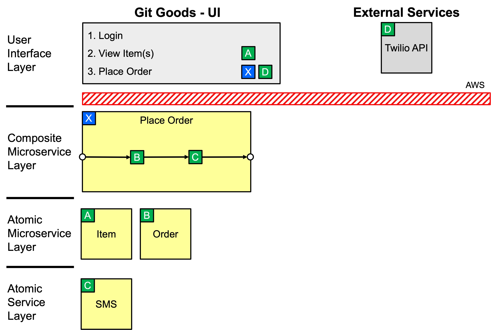
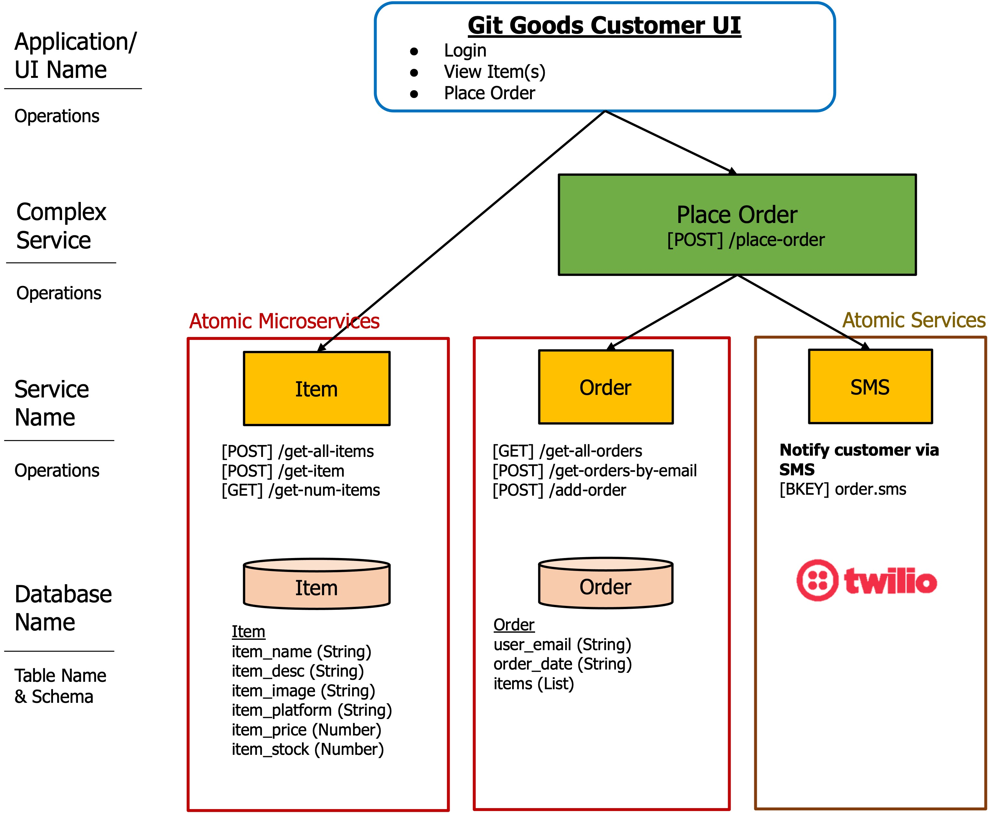
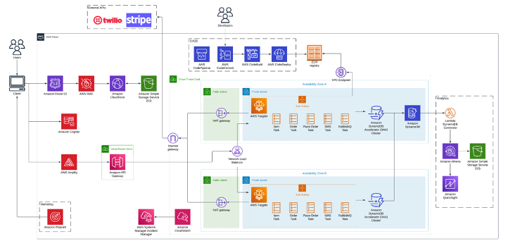
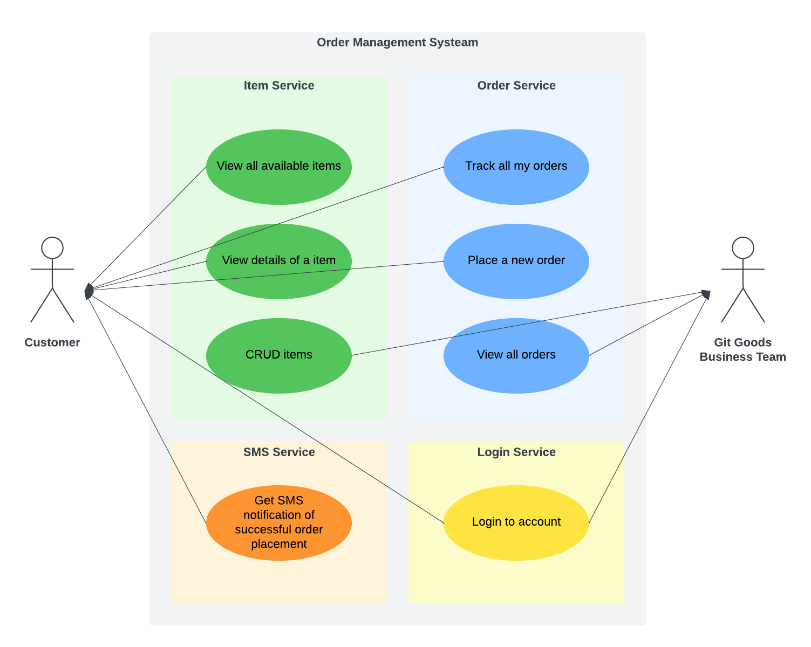
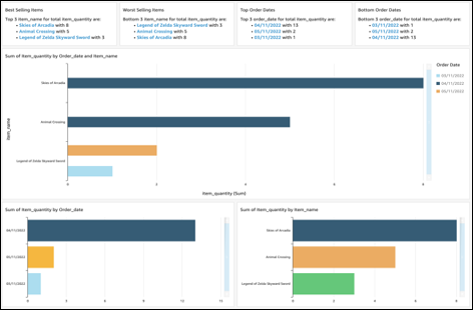
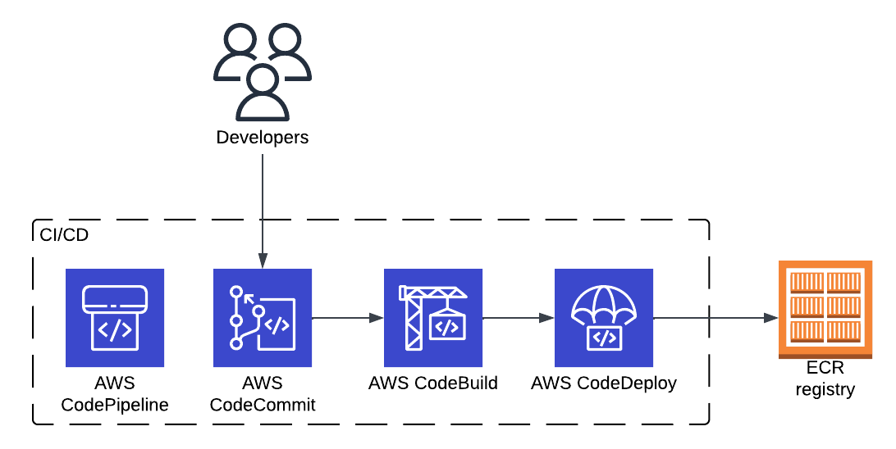

<div id="top"></div>


<!-- PROJECT LOGO -->
<br />
<div align="center">
  
  <h3 align="center">Git Goods</h3>
  <p align="center">
    Online Shopping System
  </p>
</div>


<!-- TABLE OF CONTENTS -->
<details>
  <summary>Table of Contents</summary>
  <ol>
    <li>
      <a href="#about-the-project">About The Project</a>
    </li>
    <li>
      <a href="#getting-started">Getting Started</a>
    </li>
    <li>
      <a href="#requirements">Requirements</a>
    </li>
    <li>
      <a href="#analytics-pipeline">Analytics Pipeline</a>
    </li>
    <li>
      <a href="#design-considerations">Design Considerations</a>
    </li>
  </ol>
</details>


<!-- ABOUT THE PROJECT -->
## About The Project
Git Goods is an online shopping platform that focuses on selling a variety of games and products. To cater to its large customer base of avid gamers, the application has been designed to manage surges in traffic and minimise outages. 
<a href="#requirements">Read more</a>

### Technical Diagrams
<div align="center">
	
	
</div>

> SOA Layered Architecture and Technical Overview Diagram

### Deployment Infrastructure
<div align="center">
	
</div>

> Solution Architecture

<p align="right">(<a href="#top">back to top</a>)</p>


### Built With

### Frontend
* [Vue.js](https://vuejs.org/)
* [Vuetify](https://vuetifyjs.com/en/)

### Backend
* [Flask](https://flask.palletsprojects.com/)
* [RabbitMQ](https://rabbitmq.com)
* [Docker](https://docker.com)

### External APIs used
* [Twilio API](https://www.twilio.com/docs/sms/api/message-resource)

<p align="right">(<a href="#top">back to top</a>)</p>


<!-- GETTING STARTED -->
## Getting Started

Run `docker compose up` to start all services

### Containerising an individual service
  ``` sh
  $ docker build -f order.Dockerfile -t docker_id/order:1.0 ./

  $ docker run —-env-file ./.env -p 5002:5002 docker_id/order:1.0
  ```

### Running public images
  ``` sh
  $ docker run -d --name some-rabbit -p 5672:5672 -p 15672:15672 rabbitmq:3-management 
  ```

<p align="right">(<a href="#top">back to top</a>)</p>


## Requirements
<div>
  
</div>

> Use Case Diagram

### SLA
* Our site availability is set at 99.9% which corresponds to 8 hours 45 minutes and 36 seconds of downtime per year. Recovery time objective (RTO) set at 45 minutes and recovery point objective set at 12 hours. For incident response, the mean time to detect (MTTD) will be 10 minutes.

### Technical Requirements

| Reliability  | Performance Efficiency | Operability |
| ------------------------ | ------------------------ | ------------------------ |
| System must be able to recover from failure with data loss within SLAs. | Site should be displayed to at least 1,000 concurrent users in < 500ms | Monitoring tools in-place to ensure our system’s operations always meet our SLAs. |
| Persistent and durable data storage to prevent data loss. | Validation of order placed should take < 500ms | Messaging integrations to immediately alert any consistent spike in monitoring metrics or failures within 20mins. |
| Automated backups every 12 hours. Warm Standby disaster recovery strategy to meet RTO. | | |

| Security  | Maintainability |
| ------------------------ | ------------------------ |
| Firewall in front of application and DDoS protection to stop attack on network while ensuring secure data flow and storage. | Microservices architecture to ensure individual services are independent of one another, and changes to one would have minimal impact on the rest. |
| Personally identifiable information will be changed from plaintext to ciphertext through field-level encryption in order to protect sensitive data fields individually while retaining the structure of the application payload. It should be encrypted or masked both in transit and at rest. | Automated CI/CD pipeline should finish in under 30 mins. |

<p align="right">(<a href="#top">back to top</a>)</p>


## Analytics Pipeline

### Analytics Report for Sellers
We use Athena’s Federated Query feature to query DynamoDB, which stores sellers’ sale data, to build analytics reports and gain quick insights on our customers.

<div>
  
</div>

> Quicksight Visualisations

### DevOps Monitoring of CI/CD Pipeline
To monitor required CI/CD metrics like throughput, productivity and deployment failures, we re-used Athena and QuickSight to build custom visualisations. When a developer pushes a code change, it goes through several phases in CodePipeline. For each action in the CodePipeline, the following series of actions would occur:
* An Amazon CloudWatch rule creates a CloudWatch event containing the action’s metadata.
* The CloudWatch event triggers an AWS Lambda function.
* The Lambda function extracts relevant reporting data and writes it to a CSV file in an Amazon S3 bucket.
* Amazon Athena queries the Amazon S3 bucket and loads the query results into SPICE (an in-memory engine for Amazon QuickSight).
* Amazon QuickSight obtains data from SPICE to build dashboard displays for the management team.

Our development team can then utilise this data to improve their processes and optimise future releases.

<p align="right">(<a href="#top">back to top</a>)</p>


## Design Considerations

### Multi-AZ Deployment
<div align="center">
  
</div>

Our entire Fargate environment containing our running services would be replicated across multiple availability zones. When an incident occurs on one of these availability zones affecting its availability, we are able to automatically failover to our other availability zones to minimise any disruption and downtime experienced by customers.

<p align="right">(<a href="#top">back to top</a>)</p>

### DynamoDB Accelerator (DAX)
<div align="center">
  
</div>

* DAX High Availability: While DynamoDB itself has high availability, AWS DAX is also used to serve as the in-memory cache layer to retrieve frequently accessed information to improve performance, while also handling and performing its own automatic failover in the event a primary node in a DAX cluster fails. This can help to supplement cases where DynamoDB is unable to serve read traffic due to I/O suspensions for backups or scheduled maintenance, and read traffic can be resolved at DAX, thereby increasing the availability of our database as well. 

* DAX Cluster Horizontal Scaling: DAX helps with our scalability as well because of the use of nodes. We create a DAX cluster, which consists of different nodes, each with their own instance of the DAX caching software. One of the nodes is the primary node while the rest are read replicas. In the event of high traffic, we can create more nodes. We chose to use horizontal scaling, which increases the number of read replica nodes.

<p align="right">(<a href="#top">back to top</a>)</p>

### Fargate
<div align="center">
  
</div>
Each of our Fargate environments across different Availability Zones or Regions will be placed within an auto scaling group to be able to meet the required user load.

* Target Tracking Scaling Policies: used to help define how ECS can respond in events of low or high traffic, where CPU utilisation falls below or goes above a certain threshold. This minimises cost by scaling down infrastructure (launching more tasks) when the application load does not fully utilise the instances they are running on, or scaling up infrastructure to prevent it from bursting when more traffic is received. 

* Step Scaling Policies: In anticipation of disproportionately high traffic such as during the Sales period, target tracking scaling policies may not respond quickly enough as it assumes that the resource utilisation metric would scale proportionally when more tasks are added. For such scenarios, we would define Step Scaling Policies instead as it gives us more control over our resources by being able to define custom bounds and how many tasks to add or remove at different boundaries.

<p align="right">(<a href="#top">back to top</a>)</p>

### CI/CD Pipeline
* Using AWS CodePipeline, we automated the build, tag, push and deploy steps for faster and more consistent deployments when code is updated. We used AWS CodeCommit to host our private Git repository, providing version control and a tool for source code management. This also helps to minimise any unnecessary network calls through the internet.
<div align="center">
  
</div>

* Our ECS containers are set up with blue/green deployment, where blue is the current task running, and green is the new task with the latest image pulled from ECR. Once ECS determines that the new task is running fine and healthy, it will route all traffic to the new task, before draining the old task and retiring it.

<p align="right">(<a href="#top">back to top</a>)</p>

### Web Application Firewall
* WAF helps to prevent threats such as DDos or injection attacks. 
* With AWS Cloudfront and WAF integration, we are able to block any malicious requests made to the Cloudfront CDN based on the criteria defined in the WAF Access Control List (ACL) associated with the CDN distribution.

<p align="right">(<a href="#top">back to top</a>)</p>

### Cognito
Cognito provides a convenient way to add user sign-up and sign-in features, as well as to control access to web applications. 
* With Cognito User Pools, aws helps to handle the resources which users will use to authenticate with. 
* Using Cognito Identity Pools, we are able to authorise certain uses and grant them temporary access to other services. In this case, we are able to provide temporary AWS credentials to the Git Goods business team when they need to access certain AWS resources.

<p align="right">(<a href="#top">back to top</a>)</p>
